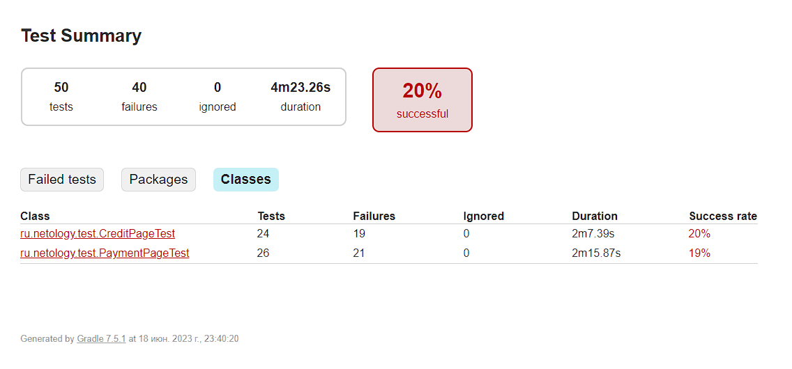

## Отчет по итогам тестирования
### Краткое описание

На первом этапе дипломной работы было проведено ручное тестирование приложения.

На втором этапе были написаны автотесты и проведено автоматизированное тестирование приложения.

Тестовые сценарии были позитивные и негативные, так же проведены тесты UI, тесты БД.

Тестирование было проведено для двух БД - MySQL и PostgreSQL.
### Тест-кейсов - 50 , из них
- успешных - 10
- неуспешных - 40

### Общие рекомендации
- Исправить выявленные дефекты, описанные в работе.
- Разработать точные требования в документации.
- Изменить информацию в сплывающих окнах об ошибках на точно описывающую ошибку